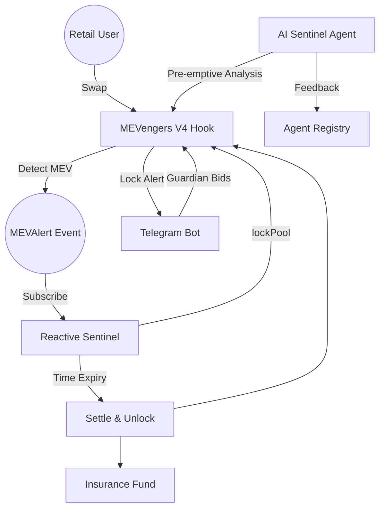

# MEVengers 🛡️
### Autonomous & Community-Driven MEV Protection on Unichain

**MEVengers** is a world-first autonomous MEV (Maximum Extractable Value) protection system. By leveraging **Uniswap V4 Hooks**, the **Reactive Network**, and a decentralized **AI Sentinel**, it transforms MEV from a zero-sum extractive force into a positive-sum community defense mechanism.

---

## 🔗 Live Deployments (Judge Hub)
- **Interactive Pitch & Demo**: [mevengers.vercel.app/presentation.html](https://mevengers-presentation.vercel.app/presentation.html) *(Coming Soon / Example)*
- **Telegram Guardian Bot**: [@MEVengers_Protection_bot](https://t.me/MEVengers_Protection_bot) 🛡️
- **AI Sentinel Hub**: [tender-imagination-production-982a.up.railway.app](https://tender-imagination-production-982a.up.railway.app)
- **Unichain Sepolia Hook**: `0x756751bE0FD74cdbB7af4410ca3aB4C02372c0c0`

---

## 📖 Table of Contents
- [Overview](#overview)
- [The Problem](#the-problem)
- [The Solution](#the-solution)
- [Core Features](#core-features)
- [Architecture](#architecture)
- [Technology Stack](#technology-stack)
- [Project Structure](#project-structure)
- [Getting Started](#getting-started)
- [Usage & Demo](#usage--demo)
- [Innovation & Optimizations](#innovation--optimizations)
- [Challenges & Learnings](#challenges--learnings)
- [Roadmap & Future Improvements](#roadmap--future-improvements)

---

## 🌟 Overview
Traditional DeFi protections are either too slow (governance-based), too simple (static fees), or too reactive (post-hoc insurance). **MEVengers** introduces a real-time, autonomous "circuit breaker" for Uniswap V4 pools. 

When a malicious swap is detected, the system instantly "freezes" the pool, initiates a decentralized auction for "Guardians" to re-price the risk, and autonomously redistributes 50% of the auction premiums to the victims.

---

## ⚠️ The Problem
Retail traders on DEXs suffer from an "invisible tax" via sandwich attacks and front-running.
1. **Inefficient Fees**: Static fees cannot adapt to dynamic MEV conditions.
2. **Human Latency**: Most "panic buttons" or auction settlements rely on human intervention or centralized keepers.
3. **Complex UX**: MEV protection is usually too technical for the average user to engage with.

---

## ⚡ The Solution: The MEVengers Lifecycle
1. 🔍 **Detection (Unichain)**: Our custom **Uniswap V4 Hook** monitors every swap for MEV signatures (rapid sequence, volume spikes) and emits a real-time `MEVAlert`.
2. 🛑 **Autonomous Response (Reactive Network)**: The **Reactive Auction Sentinel** catches the alert and instantly dispatches a cross-chain callback to Unichain to `lockPool()`, applying a 5.0% "poison pill" fee to attackers.
3. 🗳️ **Community Governance (Telegram)**: "Guardians" receive notifications via the **MEVengers Bot** and bid in ETH to establish a new "Safe Fee" for the pool.
4. 🤖 **AI Intelligence (Sentinel Agent)**: An **AI Agent** provides pre-emptive risk scores and manages Guardian reputation on-chain using the **ERC-8004** standard.
5. ✅ **Autonomous Settlement**: The Reactive Sentinel tracks the 3-minute auction timer and automatically settles the auction on Unichain—no human "settle" transaction required.

---

## 🎛️ Core Features
- **Flashblock-Aware Detection**: Built for Unichain's 200ms pre-confirmations.
- **Protective Auctions**: A Time-Weighted mechanism where the community determines the pool's safety level.
- **MEV Insurance Fund**: 50% of all winning premiums are autonomously vaulted to compensate victims.
- **Hybrid Reliability**: A high-performance **Node.js Relayer** provides a safety net if cross-chain callback latency occurs.
- **Guardian Reputation System**: AI-driven scoring that rewards long-term honest defenders with near-zero trading fees.

---

## 🏗️ Architecture



---

## 🛠️ Technology Stack
- **Smart Contracts**: Solidity (Foundry)
- **Hooks Framework**: Uniswap V4 Core
- **Cross-Chain Compute**: Reactive Network
- **Blockchain Interface**: Viem (High-performance JS library)
- **Intelligence**: Node.js / TypeScript (AI Pattern Analysis)
- **Frontend**: Next.js 15, Tailwind CSS, Shadcn/UI
- **UX**: Telegram Bot (Node-Telegram-Bot-API)

---

## 📂 Project Structure
```text
mevengers/
├── contracts/          # Uniswap V4 Hooks & Reactive Network Contracts
│   ├── src/            # MEVengersHook, MEVAuctionSentinel, MEVInsuranceFund
│   └── script/         # Deployment & Setup scripts
├── bot/                # Telegram Interface & Hybrid Relayer
│   ├── src/index.js    # Telegram Bot Engine
│   └── src/relayer.js  # Fallback Settlement logic
├── agent/              # AI Intelligence Layer
│   └── src/index.ts    # ML pattern detection & reputation scoring
├── frontend/           # Discovery Dashboard (Next.js)
└── PRD.md              # Detailed Product Requirements
```

---

## 🚀 Getting Started

### 1. Prerequisites
- [Foundry](https://getfoundry.sh/)
- [Node.js](https://nodejs.org/) v20+

### 2. Smart Contract Setup
```bash
cd contracts
forge build
# Run tests
forge test
```

### 3. Bot & Relayer Setup
```bash
cd bot
npm install
# Configure your .env with RPCs and Private Keys
npm run start   # Launches Telegram Bot
npm run relay   # Launches Fallback Relayer
```

### 4. AI Agent Setup
```bash
cd agent
npm install
npm run start
```

---

## 🎮 Usage & Demo
1. **Connect**: Launch the Telegram Bot and run `/connect` to assign yoursell a Guardian persona.
2. **Trigger**: Run `node bot/src/trigger_mev.js` or `node bot/src/demo_ping.js` to simulate a real MEV attack.
3. **Defend**: You will receive a Telegram alert. Tap **"⚡ Become a Guardian"** to place a bid.
4. **Settle**: Watch as the Reactive Sentinel (or fallback relayer) settles the auction and returns rewards to your wallet!

---

## 🏆 Innovation & Optimizations
- **ERC-8004 Integration**: We use an Agent Registry for cross-chain feedback, allowing the AI to "vouch" for Guardians.
- **Gas Efficiency**: Minimal storage writes; MEV scores are calculated in-memory and emitted via events to keep swap gas costs low.
- **Multilayered Redundancy**: The interaction between Reactive Network and our Node.js Relayer ensures the pool is *always* eventually unlocked.

---

## 🚧 Challenges & Learnings
- **Cross-Chain Latency**: Designing for the gap between Unichain and Reactive Network required a robust "lock" state that remains safe even if the settlement callback is delayed.
- **V4 Hook Limits**: Balancing complex MEV detection logic with the gas constraints of `_beforeSwap`.

---

## 🗺️ Roadmap
- [ ] **Phase 4**: Mainnet-grade AI models using `onnxruntime-node`.
- [ ] **Phase 5**: Multi-pool coordination for "Global Sentinel" mode.
- [ ] **Phase 6**: Direct integration with Uniswap V4 UI for seamless Guardian bidding.

---

**Built for the future of Ethereum. Developed for Unichain & Reactive Network.** ⚡🛡️
